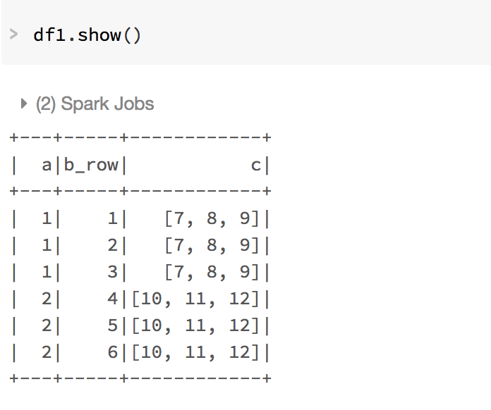
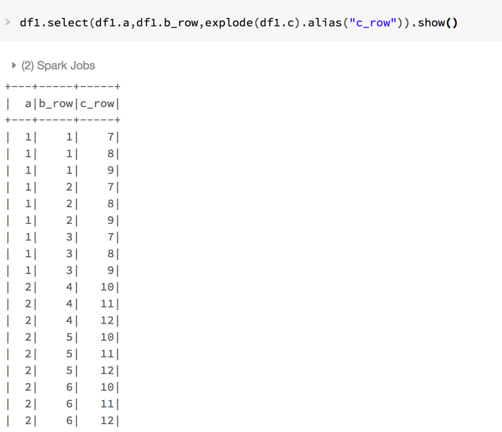

## Spark中的RDD（Spark 1.X中常用）

###基本概念
J理解为**<u>RDD以分区的形式分布在集群中多个机器上，每个分区代表了数据集的一个子集，Spark框架并行处理多个分区，一个分区内的数据对象则是顺序处理。</u>**

**RDD是（Resilient Distributed Dataset）弹性分布式数据集，每个RDD分为多个分区partition，这些分区运行在集群中的不同节点上，而每个分区中以行为单位，每一行由元素组成。RDD有两类操作，一种是转化transform成为新的RDD，一种是行动action计算出一个结果。**

<u>rdd-分区表示子集partition（不同节点上）-行为单位，每行都是元素</u>

**pair RDD is an RDD where each element is a pair tuple (k, v) where k is the key and v is the value。**

**RDD 分区的一个分配原则是：尽可能使得分区的个数，等于集群cores数目。这里的core是虚拟的core而不是机器的物理CPU核，可以理解为就是Executor的一个工作线程，J即一个executor有多个cores。**

<u>RDD有两类操作：转化（transformation生成一个新的RDD）和行动（action计算出一个结果）。</u>

###操作
RDD的持久化，**J无需计算重新计算整个rdd转换**

<u>通过persist()或cache()方法可以标记一个要被持久化的RDD</u>，一旦首次被触发，该RDD将会被保留在计算节点的内存中并重用。
例子：假设首先进行了RDD0→RDD1→RDD2的计算作业，那么计算结束时，RDD1就已经缓存在系统中了。在进行RDD0→RDD1→RDD3的计算作业时，由于RDD1已经缓存在系统中，因此RDD0→RDD1的转换不会重复进行，计算作业只须进行RDD1→RDD3的计算就可以了，因此计算速度可以得到很大提升。

```scala
distFile.persist()//持久化  
```

**broadcast 变量, 只读的共享变量，每个节点上都有一个拷贝。val v = broadcastVar.value //这么取值**

```scala
val broadcastVar = sc.broadcast("string test")//broadcast variable is readonly
val v = broadcastVar.value //这么取值
```

## Spark中的dataset（Spark 2.X中常用）

### 统一使用：SparkSession

使用Spark时经常出现的一个问题是：“好了，我们有了SparkContext、SQLContext和HiveContext。我该使用哪一个，而不是其他几个”Spark 2.0引入了一个新的SparkSession对象，因而减少了混乱，为使用Spark来计算提供了一致的入口点。

### 使用API尽量使用DataSet ,不行再选用DataFrame，其次选择RDD。

RDD[Person]以Person为类型参数，但Spark框架本身不了解Person类的内部结构。而DataFrame可以进一步提供详细的结构信息，使得SparkSQL可以清楚地知道该数据集中包含哪些列，每列的名称和类型各是什么。
<u>**Jdataframe在2.0中更改只有指定了类型后，变成dataset后，才知道类型。**</u>

<u>**J我明白了，这里的dataset和dataframe的最重要区别确实就是不知道类型而已。从而各自的api的功能也不一样，涉及到字段类型的，就是dataset，而不涉及到字段类型的就是dataframe。但其实dataframe也可以用dataset的api，只是在构建阶段可能查不出问题，有一定风险性。为了便捷，我就使用dataframe，但是查dataset的api来使用**</u>

<u>**J重要区别：所以利用sparksql返回dataframe是因为每一行的类型和字段都是相同的。而dataset适应更广阔的舞台，比如说一行是row，另一行不是row。**</u>

就是说其实dataframe有字段,我们可以看到

|query|        dt|search_count|plat|
+-----+----------+------------+----+
| 幸福路上|2017-11-16|          68| ios|
| 幸福路上|2017-11-15|          95| ios|
| 幸福路上|2017-11-19|          40| ios|
| 幸福路上|2017-11-17|          32| ios|
| 幸福路上|2017-11-20|        2580| ios|
| 幸福路上|2017-11-18|          27| ios|

**但是如果是运算的话，则需要使用告诉下面的代码程序这个里面的具体类型，否则会编译有问题。比如指定dataset的api的话,就要先转成dataset才能用。**

### 创建Dataframe，从spark sql

```scala
//即SparkSession的方法sql允许application在代码中运行SQL语句，并得到Dataset<Row>类型的返回值。
// Register the DataFrame as a SQL temporary view 必须注册为临时表才能供下面的查询使用
val sqlDF = spark.sql("SELECT * FROM people")
sqlDF.createOrReplaceTempView("people") //之后可以被当作people表被spark.sql使用
sqlDF.show()
```

### 创建dataset：toDS()或as

There is also a new `as[U](implicit arg0: Encoder[U]): Dataset[U]`which is used to convert a `DataFrame` to a `DataSet` of a given type. For example: 

```scala
df.as[Person]
df.select($"name", $"age".cast("int")).as[(String, Int)].collect.toMap
```

J注意as中采用的定义方法，就是类似函数中的输入参数。

```scala
val gamma = df_gamma.select(col("rd"), col("gamma")).as[((Int, Int), Double)].collect.toMap
```


##Spark Dataframe的常用操作

###文件中创建dataframe（先成为RDD，然后定义类，最后配合toDF进行转换）

```scala
case class Session(query: Long, item_click_list: Seq[(Long, Boolean)]) //case class help define row, toDF
val data = spark.read.textFile("E:\\sparkdata.txt")
val df_sessions_raw = data.map(line => line.split(" ")).map(array =>
  Session(
    array(0).toLong,
    Seq((array(1).toLong, array(11).toBoolean),
      (array(2).toLong, array(12).toBoolean),
      (array(3).toLong, array(13).toBoolean),
      (array(4).toLong, array(14).toBoolean),
      (array(5).toLong, array(15).toBoolean),
      (array(6).toLong, array(16).toBoolean),
      (array(7).toLong, array(17).toBoolean),
      (array(8).toLong, array(18).toBoolean),
      (array(9).toLong, array(19).toBoolean),
      (array(10).toLong, array(20).toBoolean)
    )
  )
).toDF
```


### var与loop搭配，对同名dataframe进行更新

```scala
var dataFrame:DataFrame = null
for (jsonfilename <- fileArray) {
   val eachDataFrame = hivecontext.read.json(jsonfilename)
   if(dataFrame == null)
      dataFrame = eachDataFrame
   else
      dataFrame = eachDataFrame.unionAll(dataFrame)
}
```


###常用操作符
select;

filter;

withColumn;

withColumnRenamed;

groupBy...agg;

###使用说明
**<u>如果不涉及运算的，则使用""表示column；如果涉及运算的，则使用\$""表示column，因此filter常用\$""。</u>**

###实例
多个运算符可以用逗号去引导换行。
```scala
df_remark.filter($"type" === "4" || $"type" =!= "5")
         .order("result".desc)
df_remark_language.filter(not($"remark".contains("@BI_ROW_SPLIT@")))
df_remark_music.withColumn("notion", regexp_extract($"remark", "《(.*)》", 1))
               .withColumn("category", myfunc(regexp_replace($"remark", "《.*》", "")))
df_sn_sep.groupBy("singer").agg(sum($"hot") as "result")
```
### 配合udf操作

格式为`val myfunc = udf{(a:String) => 函数体}`

```scala
val alias = Map("^G.E.M.邓紫棋$|^G.E.M.邓紫棋(?=、)|(?<=、)G.E.M.邓紫棋(?=、)|(?<=、)G.E.M.邓紫棋$" -> "邓紫棋")
val broadcasted_alias = sc.broadcast(alias)
//没有使用 broadcast的话，每次task都要传一下，浪费内网带宽
val myalias = udf{(a:String) => 
  if(a != null & a != ""){
    var result = ""
    var str = a.trim
    for ((k,v) <- broadcasted_alias.value){
      val pattern = Pattern.compile(k)
      val matcher = pattern.matcher(str)
      if (matcher.find()){
        str = str.substring(0, matcher.start()) + v + str.substring(matcher.end(), str.length)
        result = str
      }
    }
    result
  }
  else {""}
}
```

注意当column内部是`arraytype`和`structtype`的情况时，则需要对于`udf`的参数不能直接用`udf{(uc: Seq[(Long, Boolean)])`。

```scala
println (df_sessions_raw.schema)
df_sessions_raw.printSchema
//从这个StructField往下看：(query,LongType,true)，考虑用什么类型来代替
StructType(StructField(query,LongType,true), StructField(item_click_list,ArrayType(StructType(StructField(_1,LongType,true), StructField(_2,BooleanType,true)),true),true))

root
 |-- query: long (nullable = true)
 |-- item_click_list: array (nullable = true)
 |    |-- element: struct (containsNull = true)
 |    |    |-- _1: long (nullable = true)
 |    |    |-- _2: boolean (nullable = true)
```

因为如下可知，`arraytype`和`structtype`对应的是`Seq`和`Row`。

| 数据类型      | Scala中的值类型                                              | 访问或者创建数据类型的API                                    |
| ------------- | ------------------------------------------------------------ | ------------------------------------------------------------ |
| ByteType      | Byte                                                         | ByteType                                                     |
| ShortType     | Short                                                        | ShortType                                                    |
| IntegerType   | Int                                                          | IntegerType                                                  |
| LongType      | Long                                                         | LongType                                                     |
| FloatType     | Float                                                        | FloatType                                                    |
| DoubleType    | Double                                                       | DoubleType                                                   |
| DecimalType   | scala.math.BigDecimal                                        | DecimalType                                                  |
| StringType    | String                                                       | StringType                                                   |
| BinaryType    | Array[Byte]                                                  | BinaryType                                                   |
| BooleanType   | Boolean                                                      | BooleanType                                                  |
| TimestampType | java.sql.Timestamp                                           | TimestampType                                                |
| DateType      | java.sql.Date                                                | DateType                                                     |
| ArrayType     | scala.collection.Seq                                         | ArrayType(elementType, [containsNull]) 注意containsNull默认为true |
| MapType       | scala.collection.Map                                         | MapType(keyType, valueType, [valueContainsNull]) 注意valueContainsNull默认为true |
| StructType    | org.apache.spark.sql.Row                                     | StructType(fields) ，注意fields是一个StructField序列，相同名字的两个StructField不被允许 |
| StructField   | The value type in Scala of the data type of this field (For example, Int for a StructField with the data type IntegerType) | StructField(name, dataType, nullable)                        |

改用如下函数

```scala
val click2distance = udf{(uc: Seq[Row]) =>
var pre_click = -1
uc.zipWithIndex.map{case (Row(u:Long,c:Boolean), r) =>
  val d = r - pre_click - 1
  if (c) pre_click = r
  (u, c, r, d)
}
}
```


### 常用函数

#### explode

把列中数据切开，并进行延展。先变成列表List，然后直接使用explode。

```scala
df_remark_music.filter($"remark".contains("@BI_ROW_SPLIT@"))
               .withColumn("remark_new", explode(split($"remark", "@BI_ROW_SPLIT@")))
```





#### window function

窗口函数可以对传统的groupBy分的组，进一步进行操作。

```scala
import org.apache.spark.sql.expressions.{Window, WindowSpec}
val window_cover_song = Window.partitionBy("cover_song")
val window_song = Window.partitionBy("song")
val df= df_remark_ref_final.withColumn("cover_value", sum($"cover_hot").over(window_cover_song))
                           .withColumn("value", max($"hot").over(window_song))
```

注意window function常会引起`Failed to get broadcast`，解决方法具体见debug章节。

#### withcolumn

将`stucttype`类型拆开。

```scala
    val df_sessions = df_sessions_distance.select($"query", explode($"click2distance").alias("group"))
      .withColumn("reorder", reorder($"query", $"group"))
      .groupBy($"reorder").agg(count("reorder").alias("cnt"))
      .withColumn("q", $"reorder._1")
      .withColumn("u", $"reorder._2")
      .withColumn("r", $"reorder._3")
      .withColumn("d", $"reorder._4")
      .withColumn("c", $"reorder._5")
      .select("q", "u", "r", "d", "c", "cnt")
```

```scala
+--------------------+---+
|reorder             |cnt|
+--------------------+---+
|[317,2909,7,4,false]|1  |

StructType(StructField(reorder,StructType(StructField(_1,LongType,false), StructField(_2,LongType,false), StructField(_3,IntegerType,false), StructField(_4,IntegerType,false), StructField(_5,BooleanType,false)),true), StructField(cnt,LongType,false))

root
 |-- reorder: struct (nullable = true)
 |    |-- _1: long (nullable = false)
 |    |-- _2: long (nullable = false)
 |    |-- _3: integer (nullable = false)
 |    |-- _4: integer (nullable = false)
 |    |-- _5: boolean (nullable = false)
 |-- cnt: long (nullable = false)
```


## Reference

- [Spark 编程指南简体中文版 ](https://www.kancloud.cn/kancloud/spark-programming-guide/51563)
- [Using Spark UDFs with struct sequences](https://stackoverflow.com/questions/45080913/using-spark-udfs-with-struct-sequences)