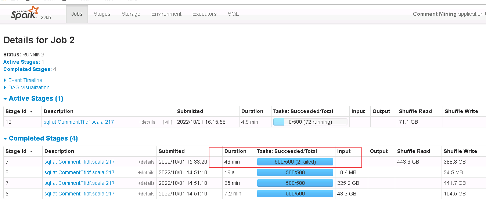
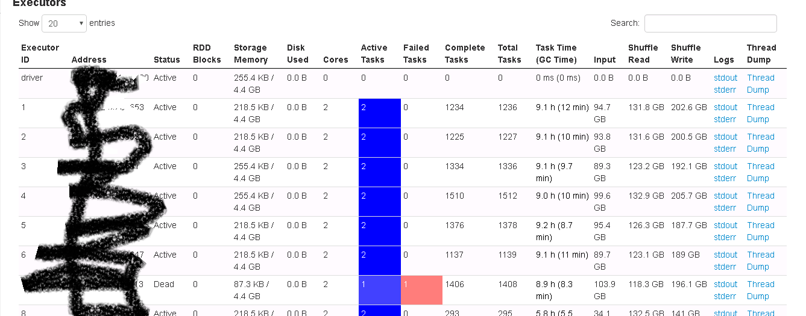
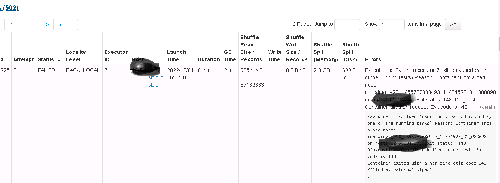
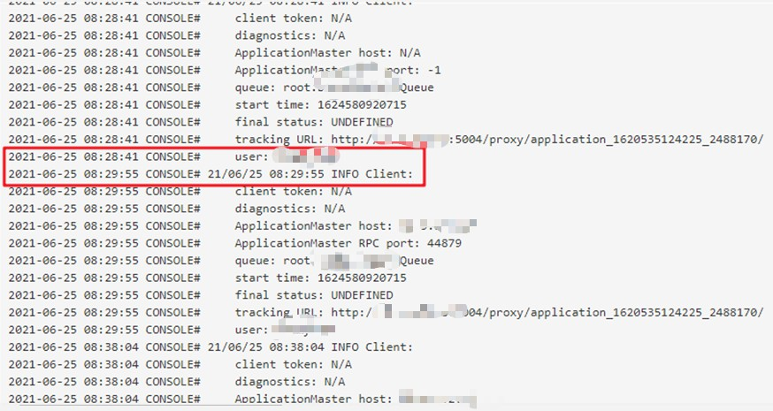
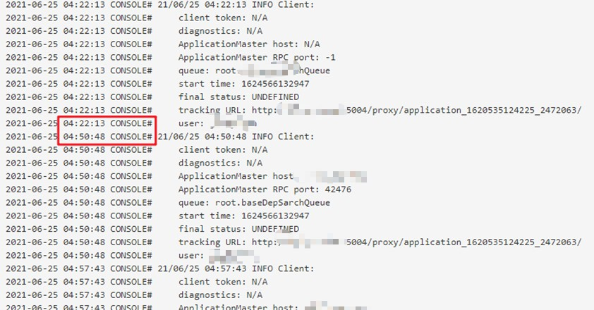

# Debug

## :paste报错

注意当使用:paste复制函数时，一定要检查是否全部是空格，不能有回车键。可以利用选中查看。
利用sublime的crtl+H功能进行替换。

##Join发散问题（返回多行）
```scala
val period_search = spark.sql("select query, a.dt, (case when a.dt=b.dt then cnt else 0 end) as count from date_table a LEFT OUTER JOIN keyword_30_sum b on a.label=b.label")

val period_search2 = spark.sql("select query, dt, max(count) as cnt from (select query, a.dt, (case when a.dt=b.dt then cnt else 0 end) as count from date_table a LEFT OUTER JOIN keyword_30_sum b on a.label=b.label) group by query, dt ")
```

##查询函数一定要在官方页面查找返回对象的页面才能搜到方法
http://spark.apache.org/docs/2.0.0/api/scala/index.html#org.apache.spark.sql.Dataset
比如filter只有在上面这个页面内才行。
比如over必须在avg的返回对象Column上。

##ERROR LiveListenerBus
```linu
17/03/28 10:56:19 ERROR LiveListenerBus: Dropping SparkListenerEvent because no remaining room in event queue. This likely means one of the SparkListeners is too slow and cannot keep up with the rate at which tasks are being started by the scheduler.

17/03/28 10:56:19 WARN LiveListenerBus: Dropped 1 SparkListenerEvents since Thu Jan 01 08:00:00 CST 1970
```

当消息队列中的消息数超过其spark.scheduler.listenerbus.eventqueue.size设置的数量(如果没有设置,默认为10000)时，会将最新的消息移除，这些消息本来是通知任务运行状态的，由于你移除了，状态无法得到更新，所以会出现上面描述的现象

解决方法，启动时加入下列参数：
```linux
--conf spark.scheduler.listenerbus.eventqueue.size=100000
```

##ConsoleProgressBar
What you get is a `Console Progress Bar`, `[Stage 7:` shows the stage you are in now, and `(14174 + 5) / 62500]` is `(numCompletedTasks + numActiveTasks) / totalNumOfTasksInThisStage]`. The progress bar shows `numCompletedTasks` / `totalNumOfTasksInThisStage`.

##Spark优化
###数据倾斜（Data Skew、data tilt）：spark作业运行过程中，最消耗性能的地方就是shuffle过程。

绝大多数task执行得都非常快，但个别task执行极慢。比如，总共有1000个task，997个task都在1分钟之内执行完了，但是剩余两三个task却要一两个小时。这种情况很常见。


数据倾斜的原理很简单：在进行shuffle的时候，必须将各个节点上相同的key拉取到某个节点上的一个task来进行处理，比如按照key进行聚合或join等操作。此时如果某个key对应的数据量特别大的话，就会发生数据倾斜。比如大部分key对应10条数据，但是个别key却对应了100万条数据，那么大部分task可能就只会分配到10条数据，然后1秒钟就运行完了;但是个别task可能分配到了100万数据，要运行一两个小时。因此，整个Spark作业的运行进度是由运行时间最长的那个task决定的。

数据倾斜只会发生在shuffle过程中。这里给大家罗列一些常用的并且可能会触发shuffle操作的算子：distinct、groupByKey、reduceByKey、aggregateByKey、join、cogroup、repartition等。出现数据倾斜时，可能就是你的代码中使用了这些算子中的某一个所导致的。

无论是使用yarn-client模式还是yarn-cluster模式，我们都可以在Spark Web UI上深入看一下当前这个stage各个task分配的数据量，从而进一步确定是不是task分配的数据不均匀导致了数据倾斜。

知道数据倾斜发生在哪一个stage之后，接着我们就需要根据stage划分原理，推算出来发生倾斜的那个stage对应代码中的哪一部分，这部分代码中肯定会有一个shuffle类算子。精准推算stage与代码的对应关系，需要对Spark的源码有深入的理解，这里我们可以介绍一个相对简单实用的推算方法：只要看到Spark代码中出现了一个shuffle类算子或者是Spark SQL的SQL语句中出现了会导致shuffle的语句(比如group by语句)，那么就可以判定，以那个地方为界限划分出了前后两个stage。

####优化groupby
```
[Stage 3:>                                                     (0 + 160) / 1500]17/12/04 10:47:50 WARN TaskSetManager: Lost task 49.0 in stage 3.0 (TID 3874, kg-dn-39, executor 10): FetchFailed(BlockManagerId(31, kg-dn-46, 8508, None), shuffleId=0, mapId=2, reduceId=49, message=org.apache.spark.shuffle.FetchFailedException: java.io.EOFException
```
查询网上资料，这个问题就是shuffle的read量大，但是partitions太小造成的，一种是控制输入数据，第二种是修改参数，比如这里的提高partitions数目。

#### 提高shuffle操作的并行度，如果我们必须要对数据倾斜迎难而上，那么建议优先使用这种方案，因为这是处理数据倾斜最简单的一种方案。
思路：**<u>增加shuffle read task的数量，可以让原本分配给一个task的多个key分配给多个task，从而让每个task处理比原来更少的数据。</u>**举例来说，如果原本有5个key，每个key对应10条数据，这5个key都是分配给一个task的，那么这个task就要处理50条数据。而增加了shuffle read task以后，每个task就分配到一个key，即每个task就处理10条数据，那么自然每个task的执行时间都会变短了。

J就是在spark.sql中使用了groupby，所以特别慢。
设置方法：`spark.conf.set("spark.sql.shuffle.partitions", 1000)`
好处：方便
缺点：对于极端情况无能为力：比如某个key对应100万数据，对于我们来说，每天一个关键词的搜索量可能最高就是几十万。但是设置过大会造成性能恶化，过多的碎片task会造成大量无谓的启动关闭task开销，还有可能导致某些task hang住无法执行。

####设置patitions的大小为2001
原因：Rule of thumb is around 128 MB per partition
但是：
If you're running out of memory on the shuffle, try setting spark.sql.shuffle.partitions to 2001.
Spark uses a different data structure for shuffle book-keeping when the number of partitions is greater than 2000:

#### <u>trick</u>：

**找到代码中卡住的位置**，采用在代码中重新设置分区：

```scala
val df_status = (df_group_pair.
    filter($"count" >= 1).//avoid data skew //filter(!($"prev_word".contains($"next_word"))).
    as("d1").join(df_menu_read.as("d2"), $"d1.prev_word" === $"d2.keyword", "left").
    select($"d1.*", $"d2.name_entity" as "prev_name_entity", $"d2.similar_entity" as "prev_similar_entity", $"d2.unknown_entity" as "prev_unknown_entity", $"d2.menu_contain" as "pre_menu_contain").
    as("d3").
    join(df_menu_read.as("d4"), $"d3.next_word" === $"d4.keyword", "left").
    select($"d3.*", $"d4.result" as "next_result", $"d4.menu_contain" as "menu_contain", $"d4.name_entity", $"d4.similar_entity", $"d4.unknown_entity").
    filter($"next_result".isNotNull && $"pre_menu_contain"=!=true && $"menu_contain"=!=true).//filter tag
    filter($"prev_name_entity".isNotNull && $"prev_similar_entity".isNotNull && $"prev_unknown_entity".isNotNull).// null means not exists
    withColumn("status", check_status($"prev_name_entity", $"prev_similar_entity", $"prev_unknown_entity", $"name_entity", $"similar_entity", $"unknown_entity")).
    filter($"status" === true).
    distinct.//cause df_menu_read's keyword duplicate
    sort($"count".desc).
    repartition(numPartitions=2001))

println("max of df_status is :" + df_status.rdd.glom().map(_.length).collect().max.toString)

```


采用如下多executor和多core策略，速度更快。

```
--executor-memory 20G \
--executor-cores 2 \
--num-executors 14 \
而不是
--executor-memory 40G \
--executor-cores 1 \
--num-executors 7 \
```


##Executor heartbeat timed out
这是因为我们在调试出现的时候，整个程序运行流程就卡到那了。这时候 Driver 就无法接收到 Executor 发来的心跳信息了，从而产生这种异常。解决办法也很简单，只需要把下面两个参数加大即可：
```linux
spark.executor.heartbeatInterval
--conf spark.network.timeout=1200s（我采取了这一方法）
```
spark.executor.heartbeatInterval（默认10s） 参数要远比 spark.network.timeout（默认120s） 小。
```linux
WARN HeartbeatReceiver: Removing executor 10 with no recent heartbeats: 309431 ms exceeds timeout 240000 ms
[Stage 207:(7163 + 113) / 14150][Stage 209:(1445 + 0) / 6723][Stage 213:(476 + 0) / 2001]18/03/22 10:13:16 ERROR YarnScheduler: Lost executor 10 on kg-dn-81: Executor heartbeat timed out after 309431 ms
```

##WARN TaskSetManager: Lost task FetchFailedException: Failed to connect

shuffle分为`shuffle write`和`shuffle read`两部分。 
shuffle write的分区数由上一阶段的RDD分区数控制，shuffle read的分区数则是由Spark提供的一些参数控制。

shuffle write可以简单理解为类似于`saveAsLocalDiskFile`的操作，将计算的中间结果按某种规则临时放到各个executor所在的本地磁盘上。

shuffle read的时候数据的分区数则是由spark提供的一些参数控制。可以想到的是，如果这个参数值设置的很小，同时shuffle read的量很大，那么将会导致一个task需要处理的数据非常大。结果导致JVM crash，从而导致取shuffle数据失败，同时executor也丢失了，看到`Failed to connect to host`的错误，也就是executor lost的意思。有时候即使不会导致JVM crash也会造成长时间的gc。

```linux
[Stage 1:>(29 + 96) / 843][Stage 5:(4827 + -125) / 9888][Stage 8:(736 + 102) / 2493]18/03/21 16:38:52 WARN TaskSetManager: Lost task 7.0 in stage 11.0 (TID 34635, kg-dn-99, executor 17): FetchFailed(BlockManagerId(15, kg-dn-111, 38469, None), shuffleId=0, mapId=59, reduceId=7, message=
org.apache.spark.shuffle.FetchFailedException: Failed to connect to kg-dn-111/10.1.172.140:38469
```

### 解决办法(一开始我采取的是第三和第四项，<u>后来我发现减少并行数cores，从8至4，第五种方法</u>)

知道原因后问题就好解决了，主要从shuffle的数据量和处理shuffle数据的分区数两个角度入手。

1. 减少shuffle数据

   思考是否可以使用`map side join`或是`broadcast join`来规避shuffle的产生。

   将不必要的数据在shuffle前进行过滤，比如原始数据有20个字段，只要选取需要的字段进行处理即可，将会减少一定的shuffle数据。

2. SparkSQL和DataFrame的join,group by等操作

   通过`spark.sql.shuffle.partitions`控制分区数，默认为200，根据shuffle的量以及计算的复杂度提高这个值。

3. Rdd的join,groupBy,reduceByKey等操作

   <u>通过`spark.default.parallelism`控制shuffle read与reduce处理的分区数，默认为运行任务的core的总数（mesos细粒度模式为8个，local模式为本地的core总数），官方建议为设置成运行任务的core的2-3倍。</u>

   **<u>J似乎其实这与partitions参数都是设置partitions数目的，只是parallelism会被dataframe所忽略，所以之前我的设置根本没啥用。</u>**

   From the answer [here](https://stackoverflow.com/questions/33297689/number-reduce-tasks-spark), `spark.sql.shuffle.partitions` configures the number of partitions that are used when shuffling data for joins or aggregations.

   `spark.default.parallelism` is the default number of partitions in `RDD`s returned by transformations like `join`, `reduceByKey`, and `parallelize` when not set explicitly by the user. Note that `spark.default.parallelism` seems to only be working for raw `RDD` and is ignored when working with dataframes.

4. <u>提高executor的内存</u>

   <u>通过`spark.executor.memory`适当提高executor的memory值。</u>

5. <u>降低cores数目，避免下面单个core能力低下，长期卡住：J同时的线条是cores</u>
  

##java.lang.OutOfMemoryError: GC overhead limit exceeded

This message means that for some reason the garbage collector is taking an excessive amount of time (by default 98% of all CPU time of the process) and recovers very little memory in each run (by default 2% of the heap).

This effectively means that your program stops doing any progress and is busy running only the garbage collection at all time.

To prevent your application from soaking up CPU time without getting anything done, the JVM throws this Error so that you have a chance of diagnosing the problem.
解决方法增大driver内存：`--driver-memory 4G`


##Failed to get broadcast
```linux
[Stage 7:(860 + 88) / 7339][Stage 10:(3 + 24) / 2001][Stage 11:>(0 + 0) / 2001]18/03/22 12:04:28 WARN TaskSetManager: Lost task 6.0 in stage 10.0 (TID 24987, kg-dn-109, executor 13): java.io.IOException: org.apache.spark.SparkException: Failed to get broadcast_19_piece0 of broadcast_19
```
J猜测有的broacast被remove了，但是接下来的task又会去获取这些broadcast，便会直接失败。
本来是想禁止禁止join的自动转broadcast功能，让其还是使用sort merge join，比如`--conf spark.sql.autoBroadcastJoinThreshold=-1`。
但是后来发现原来问题在于window function未序列化。
###window function未序列化导致该问题

**<u>J我只能认为在某些版本中存在window返回未序列化的问题。</u>**

####Task not serializable
首先会报`Task not serializable`错误，这是因为window function返回的column对象是非序列化的，这就意味着都是存在各个executor中的内存里，如果需要进一步进行计算时（比如map时），系统就会提示未进行序列化，**<u>实际上未进行序列化也是可以的，只是系统必须这么提示而已，因为下面就有种方法告诉系统这个对象不需要序列化</u>**。

根据网上的[建议](https://stackoverflow.com/a/37334595/8355906)，要么就是直接对类进行序列化；要么直接在窗口对象和column对象上加上@transient的标识符。

```scala
import org.apache.spark.sql.expressions.Window
val df = Seq(("foo", 1), ("bar", 2)).toDF("x", "y")
val w = Window.partitionBy("x").orderBy("y")
val lag_y = lag(col("y"), 1).over(w)
def f(x: Any) = x.toString
df.select(lag_y).map(f _).first //it will raise error：Task not serializable

@transient val w = Window.partitionBy("x").orderBy("y")
@transient val lag_y = lag(col("y"), 1).over(w)
df.select(lag_y).map(f _).first //it will succeed
```

####WARN TaskSetManager: Lost task；IOException: org.apache.spark.SparkException: Failed to get broadcast

但是上述方法在真正需要离开当前的executor进行序列化传输时，那么就会报错。这个错误比较隐晦，根本就不提及是序列化的问题。分析原因：

Scala provides a @transient annotation for fields that should not be serialized at all. If you mark a field as @transient, then the frame- work should not save the field even when the surrounding object is serialized. When the object is loaded, the field will be restored to the default value for the type of the field annotated as @transient.
**<u>猜测@transient标记表明不被序列化后，就等于保存在各个executor的内存中。而由于大量操作导致内存被占用，从而导致丢失掉了被当做broadcast的值，从而无法进行join，报错。但我认为并非是broadcast，因为每个executor中的值是不一样的，与传统的broadcast的定义不一样。所以方法是先进行整体persist驻留在各个executor中。</u>**

但是有时候如下代码仍然randomly报错，我猜测是因为`df_ref.persist()`还未全部persist完成，结果下一批的task，也就是调用df_ref计算的任务已经上线，既然没有persist完成，那就只能调用原本的量了，因此就会报错。所以最稳妥的方法就是把两个都persist下来。这样就有时间差可以保证完成了。或者干脆在scala函数中对类进行序列化。

此外，**根据[网上描述](https://stackoverflow.com/a/37378718/8355906)，如果只是一次，其实问题不大，spark的DAGScheduler会进行重启的，J既可以无视。**

Sparks `DAGScheduler` and it's lower level cluster manager implementation (Standalone, YARN or Mesos) will notice a task failed and will take care of rescheduling the said task as part of the overall stages executed.

```
DAGScheduler does three things in Spark (thorough explanations follow):
Computes an execution DAG, i.e. DAG of stages, for a job.
Determines the preferred locations to run each task on.
Handles failures due to shuffle output files being lost.
```

```scala
df_ref.persist()
df_ref.count()

df_term.persist()
df_term.count()
```

```scala
// val window_cover_song = Window.partitionBy("cover_song")
// val window_song = Window.partitionBy("song")
// val df_ref_diff = df_remark_ref_final.filter($"song" =!= $"cover_song")
//                                        .withColumn("cover_value", sum($"cover_hot").over(window_cover_song))
//                                        .withColumn("value", max($"hot").over(window_song)) //change avg to max, cause it will exists many-many relation between song and hot, some hots are so small, it will lower the sum value, eg:凉凉
//                                        .withColumn("term",concat($"cover_song", lit(" 原唱")))
//                                        .withColumn("penality", $"value"*penality)
//                                        .groupBy("term").agg(max("penality") as "result")
//                                        .select("term", "result")
//                                        .withColumn("alias", lit("")) 

// val df_ref_eql = df_remark_ref_final.filter($"song" === $"cover_song")
//                                       .withColumn("cover_value", sum($"cover_hot").over(window_cover_song))
//                                       .withColumn("value", max($"hot").over(window_song)) //change avg to max, cause it will exists many-many relation between song and hot, some hots are so small, it will lower the sum value, eg:凉凉
//                                       .withColumn("term",concat($"cover_song", lit(" 原唱")))
//                                       .withColumn("penality", when($"cover_value" > $"value", $"value"*penality as "result").otherwise($"value"*penality*penality as "result"))
//                                       .groupBy("term").agg(max("penality") as "result")
//                                       .select("term", "result")
//                                       .withColumn("alias", lit(""))

@transient val window_cover_song = Window.partitionBy("cover_song")
@transient val window_song = Window.partitionBy("song")
val df_ref_diff_temp = df_remark_ref_final.filter($"song" =!= $"cover_song")
val df_ref_eql_temp = df_remark_ref_final.filter($"song" === $"cover_song")
@transient val diff_cover_value = sum(df_ref_diff_temp("cover_hot")).over(window_cover_song)
@transient val diff_value = max(df_ref_diff_temp("hot")).over(window_song)
//change avg to max, cause it will exists many-many relation between song and hot, some hots are so small, it will lower the sum value, eg:凉凉
@transient val eql_cover_value = sum(df_ref_eql_temp("cover_hot")).over(window_cover_song)
@transient val eql_value = max(df_ref_eql_temp("hot")).over(window_song)

val df_ref_diff = df_ref_diff_temp.withColumn("cover_value", diff_cover_value)
                                  .withColumn("value", diff_value)
                                  .withColumn("term",concat($"cover_song", lit(" 原唱")))
                                  .withColumn("penality", $"value"*penality)
                                  .groupBy("term").agg(max("penality") as "result")
                                  .select("term", "result")

val df_ref_eql = df_ref_eql_temp.withColumn("cover_value", eql_cover_value)
                                .withColumn("value", eql_value)
                                .withColumn("term",concat($"cover_song", lit(" 原唱")))
                                .withColumn("penality", when($"cover_value" > $"value", $"value"*penality as "result").otherwise($"value"*penality*penality*penality as "result"))
                                .groupBy("term").agg(max("penality") as "result")
                                .select("term", "result")

val df_ref = df_ref_eql.union(df_ref_diff)
                        .groupBy("term").agg(max("result") as "result")
                        .withColumn("alias", lit(""))
                        .select("term", "alias","result")
df_ref.persist() 
df_ref.count()

//df_term.persist()
//df_term.count()
val df_final = df_term.union(df_ref)
                        .groupBy("term", "alias").agg(max("result") as "result")  
```


###spark sql join实现

#### Join基本实现流程

总体上来说，Join的基本实现流程如下图所示，Spark将参与Join的两张表抽象为流式遍历表(`streamIter`)和查找表(`buildIter`)，通常`streamIter`为大表，`buildIter`为小表，我们不用担心哪个表为`streamIter`，哪个表为`buildIter`，这个spark会根据join语句自动帮我们完成。


在实际计算时，spark会基于`streamIter`来遍历，每次取出`streamIter`中的一条记录`rowA`，根据Join条件计算`keyA`，然后根据该`keyA`去`buildIter`中查找所有满足Join条件(`keyB==keyA`)的记录`rowBs`，并将`rowBs`中每条记录分别与`rowA`join得到join后的记录，最后根据过滤条件得到最终join的记录。

从上述计算过程中不难发现，对于每条来自`streamIter`的记录，都要去`buildIter`中查找匹配的记录，所以`buildIter`一定要是查找性能较优的数据结构。spark提供了三种join实现：sort merge join、broadcast join以及hash join。

##### sort merge join实现

要让两条记录能join到一起，首先需要将具有相同key的记录在同一个分区，所以通常来说，需要做一次shuffle，map阶段根据join条件确定每条记录的key，基于该key做shuffle write，将可能join到一起的记录分到同一个分区中，这样在shuffle read阶段就可以将两个表中具有相同key的记录拉到同一个分区处理。前面我们也提到，对于`buildIter`一定要是查找性能较优的数据结构，通常我们能想到hash表，但是对于一张较大的表来说，不可能将所有记录全部放到hash表中，另外也可以对`buildIter`先排序，查找时按顺序查找，查找代价也是可以接受的，我们知道，spark shuffle阶段天然就支持排序，这个是非常好实现的，下面是sort merge join示意图。


在shuffle read阶段，分别对`streamIter`和`buildIter`进行merge sort，在遍历`streamIter`时，对于每条记录，都采用顺序查找的方式从`buildIter`查找对应的记录，由于两个表都是排序的，每次处理完`streamIter`的一条记录后，对于`streamIter`的下一条记录，只需从`buildIter`中上一次查找结束的位置开始查找，所以说每次在`buildIter`中查找不必重头开始，整体上来说，查找性能还是较优的。

##### broadcast join实现

为了能具有相同key的记录分到同一个分区，我们通常是做shuffle，那么如果`buildIter`是一个非常小的表，那么其实就没有必要大动干戈做shuffle了，直接将`buildIter`广播到每个计算节点，然后将`buildIter`放到hash表中，如下图所示。


从上图可以看到，不用做shuffle，可以直接在一个map中完成，通常这种join也称之为map join。那么问题来了，什么时候会用broadcast join实现呢？这个不用我们担心，spark sql自动帮我们完成，当`buildIter`的估计大小不超过参数`spark.sql.autoBroadcastJoinThreshold`设定的值(默认10M)，那么就会自动采用broadcast join，否则采用sort merge join。

本来是采用`--conf spark.sql.autoBroadcastJoinThreshold=-1`，就是不让其自动broadcast，但后来我没有用，因为原来是由于其他原因造成的。

### persist/cache与broadcast的区别
RDDs are divided into partitions. These partitions themselves act as an immutable subset of the entire RDD. When Spark executes each stage of the graph, each partition gets sent to a worker which operates on the subset of the data. In turn, each worker can cache the data if the RDD needs to be re-iterated.

Broadcast variables are used to send some immutable state once to each worker. You use them when you want a local copy of a variable.

### No more replicas available for rdd

查看spark ui发现duration很长，40分钟还没结束，其余都是几秒，但是input size没有明显变大，仍然是2MB多。

因此判断是否是代码逻辑中有对于kw长度的迭代，发现果然kw过长导致运算复杂。

普通时kw长度为1000多，这里个bug长度为12万多。因此限制长度解决问题。

## spark.driver.maxResultSize报错

`**Job aborted due to stage failure: Total size of serialized results of 3979 tasks (1024.2 MB) is bigger than spark.driver.maxResultSize (1024.0 MB)** `

```
--driver-memory 10G \
--conf spark.driver.maxResultSize=10G
```

问题的本质：之前driver内存设置为1G，但是需要处理4000个分区，driver需要维护每个分区的状态，分区越多，消耗的driver内存越多，最终导致了driver的Out-Of-Memeory异常。日志里面说的很明白，所当将driver内存设置为10G后，问题迎刃而解。

Spark常见的两类OOM问题：Driver OOM和Executor OOM。如果发生在executor，可以通过增加分区数量，减少每个executor负载。但是此时，会增加driver的负载。所以，可能同时需要增加driver内存。定位问题时，一定要先判断是哪里出现了OOM，对症下药，才能事半功倍。

##Container killed by YARN for exceeding memory limits

Consider boosting spark.yarn.executor.memoryOverhead or disabling yarn.nodemanager.vmem-check-enabled because of YARN-4714.

```
--conf spark.yarn.executor.memoryOverhead=30G
```

分析过程如下：

原因分析：该问题是由于function函数使用的是堆外内存，默认堆外内存只有max( executorMemory * 0.10，384M)，

可根据Container killed by YARN for exceeding memory limits. 19.9 GB of 14 GB physical memory used，这里的19.9G估算出堆外内存实际需要19.9G*0.1约等于1.99G，因此最少应该设置spark.yarn.executor.memoryOverhead为2G，

为保险起见，我最后设置成了4G。因此没必要设置成30G，这么大，少一些就好了。

##org.apache.spark.shuffle.FetchFailedException

failed to allocate 16777216 byte(s) of direct memory (used: 21407727616, max: 21422538752)

Spark 在处理 shuffle partition >2000 的时候为了优化起见并不会记录所有Map阶段产生的Block 大小而是会转而使用HighlyCompressedMapStatus记录. 由参数spark.shuffle.minNumPartitionsToHighlyCompress(默认2000)控制。

因此将partition降低到1500，就能解决了。

**J一般还是用500吧。不用太稀疏。**

```
--conf spark.sql.shuffle.partitions=1500
```

[Spark Shuffle FetchFailedException 内存溢出 源码级分析解决](https://blog.csdn.net/Jaxma/article/details/106827482)

## running beyond physical memory limits

```
2021-04-03 01:15:40 CONSOLE# Exception in thread "main" org.apache.spark.SparkException: Application application_1608206170538_5912246 finished with failed status
021-04-03 01:15:40 CONSOLE#      diagnostics: Application application_1608206170538_5912246 failed 2 times due to AM Container for appattempt_1608206170538_5912246_000002 exited with  exitCode: -104
2021-04-03 01:15:40 CONSOLE# For more detailed output, check application tracking page:http://kg-nn-2:8088/cluster/app/application_1608206170538_5912246Then, click on links to logs of each attempt.
2021-04-03 01:15:40 CONSOLE# Diagnostics: Container [pid=7236,containerID=container_1608206170538_5912246_02_000001] is running beyond physical memory limits. Current usage: 2.5 GB of 2.5 GB physical memory used; 4.6 GB of 10.3 GB virtual memory used. Killing container.
```

因为executor memory是10g，cores是4.所以是2.5GB用完，因此降低cores数即可。

## Thread XXX spilling sort data of XXXX MB to disk

关于spark.sql.shuffle.partitions的定义可见[spark sql join](https://jimmy-walker.gitbook.io/sparktutorial/spark-debug#spark-sql-join-shi-xian)的分析。
这里发现的问题是，初始设置spark.sql.shuffle.partitions=500，发现某个task一直在处理，查询相关spark ui中的task的stderr发现driver一直在报`spilling sort data of`，并且发现该task的Shuffle Spill (Memory)异常大1000多G，其他task只有几十G。

相关知识：
shuffle spill memory： 表示spill过程中没有序列化的在内存的数据。
shuffle spill disk：表示spill结束后spill到disk的序列化后的数据。
shuffle write： 表示数据在executor之间移动，例如join、groupBy等操作。
shuffle spill跟shuffle write总体上来说不是同一类型的操作，shuffle spill表示executor内存不足以存放数据，从而spill到其他位置；shuffle write表示executor之间的数据传递大小。
因为shuffle write涉及到若需要溢写，将集合中的数据根据partitionId和key（若需要）排序后顺序溢写到一个临时的磁盘文件，并释放内存新建一个map放数据，每次溢写都是写一个新的临时文件。

所以说想为了解决数据倾斜，将spark.sql.shuffle.partitions调大，但是导致某个executor扛不住数据，需要spill到disk上，反而耽误了时间。
将其调整回spark.sql.shuffle.partitions=200。就能避免该问题。
官网有相关的spark.sql.shuffle.partitions配置方法，有空[细看](https://nealanalytics.com/blog/databricks-spark-jobs-optimization-techniques-shuffle-partition-technique-part-1/)


## TASK FAILED应对方法

网上认为会重新提交，因此不用查过往历史记录，只要通过即可。
I believe failed tasks are resubmitted because I have seen the same failed task submitted multiple times on the Web UI. However, if the same task fails multiple times, the full job fail:

org.apache.spark.SparkException: Job aborted due to stage failure: Task 120 in stage 91.0 failed 4 times, most recent failure: Lost task 120.3 in stage 91.0

### task failed
虽然ui上面显示2 failed。但是successed仍然是500。这意味着虽然这两个task失败了，但是spark重试后，全部500个task都成功了。
即使task页面，看到status还是failed，只要还在跑就是没问题。
但是过多重试会拖慢速度，少量的可以忽略，有空可以查到原因解决掉。




## 其他error

ERROR LzoCodec: Failed to load/initialize native-lzo library。
J这是由于他们安装hadoop的问题。

### spark context创建慢，是因为resourcemanager返回资源慢

下面就是创建spark context的过程log，这些log完了之后，spark context就创建完了。

根据时间差去反馈问题，应该是resourcemanager处理其他队列的资源，因此减少了这个队列的返回。





总体过程是这样的，以client为例：

```
1.启动Driver和WebUI
2.为ApplicationMaser准备Container以及设置运行环境并启动AM
3.上传配置信息以及Jar包
4.提交到Yarn上面进行执行
5.监控任务的运行状态
6.提交missing task和Result Stage
7.运行Task得到运行结果
8.停止WebUI、停止Executor、停止SparkContext、删除临时目录
```

日志针对的相应操作信息，对上述的相似描写：

```
1.Running Spark version 2.4.5 SparkContext----->开始准备启动
2.INFO Utils: Successfully started service 'sparkDriver' on port 36991.----->启动Driver
3.Start server connector----->开始准备连接
4.Started SparkUI----->启动SparkwebUI
5.Added JAR file:/home/hadoop/app/spark/examples/jars/spark-examples_2.12-2.4.5.jar----->上传Jar包到Spark
6.Connecting to ResourceManager----->连接到Resourcemanager
7.Setting up container launch context for our AM-----> 为ApplicationMaster准备container
8.Setting up the launch environment for our AM container----->为ApplicationMaster设置container的运行环境
9.Preparing resources for our AM container----->为ApplicationMaster 准备资源
10.Uploading resource file:/tmp/xx/__spark_conf__14378.zip -> hdfs://xxx/__spark_conf__.zip----->上传Spark 的配置文件
11.Submitting application application_1604816619741_0001 to ResourceManager ----->提交任务到ResourceManager
12.Application report for application_1604816619741_0001 (state: ACCEPTED) ----->监控任务的运行状态
13.Application report for application_1604816619741_0001 (state: RUNNING)
14.Application application_1604816619741_0001 has started running.----->资源分配合适开始运行Spark任务
15.NettyBlockTransferService: Server created on bigdata01:44993----->创建Netty连接
16.INFO BlockManagerMaster: Registered BlockManager ----->注册Blockmanager
17.Registered executor NettyRpcEndpointRef----->注册executor NettyRpcEndpointRef
18.INFO SparkContext: Starting job----->启动任务
19.INFO DAGScheduler: Got job 0 (reduce at SparkPi.scala:38) with 2 output partitions-----> partition信息
20.INFO DAGScheduler: Submitting 2 missing tasks from ResultStage 0 ----->提交missing的task fro ResultStage
21.INFO YarnScheduler: Adding task set 0.0 with 2 tasks
22.INFO TaskSetManager: Starting task 0.0 in stage 0.0 ----->启动Task
23.INFO BlockManagerInfo: Added broadcast_0_piece0 in memory on bigdata01:44924 
24.INFO TaskSetManager: Finished task 0.0 in stage 0.0 (TID 0) ----->TaskS完成
25.INFO DAGScheduler: ResultStage 0 (reduce at SparkPi.scala:38) finished in 5.051 s
26.INFO DAGScheduler: Job 0 finished:----->job完成
27.Pi is roughly 3.1423357116785584 ----->得到PI的计算结果
28.INFO SparkUI: Stopped Spark web UI at http://bigdata01:4040 ----->停止SparkWebUI
29.INFO YarnClientSchedulerBackend: Shutting down all executors----->停止所有的executor
30.INFO YarnClientSchedulerBackend: Stopped
```

具体本地的log：

可以看到首先是`Submitting application application_1620535124225_2671397 to ResourceManager`，然后得到`ApplicationMaster host`后，显示`Application application_1620535124225_2671397 has started running`。

```
2021-06-28 12:51:33 CONSOLE# 21/06/28 12:51:33 INFO Client: Submitting application application_1620535124225_2671397 to ResourceManager
2021-06-28 12:51:33 CONSOLE# 21/06/28 12:51:33 INFO YarnClientImpl: Submitted application application_1620535124225_2671397
2021-06-28 12:51:33 CONSOLE# 21/06/28 12:51:33 INFO SchedulerExtensionServices: Starting Yarn extension services with app application_1620535124225_2671397 and attemptId None
2021-06-28 12:51:34 CONSOLE# 21/06/28 12:51:34 INFO Client: 
2021-06-28 12:51:34 CONSOLE# 	 client token: N/A
2021-06-28 12:51:34 CONSOLE# 	 diagnostics: AM container is launched, waiting for AM container to Register with RM
2021-06-28 12:51:34 CONSOLE# 	 ApplicationMaster host: N/A
2021-06-28 12:51:34 CONSOLE# 	 ApplicationMaster RPC port: -1
2021-06-28 12:51:34 CONSOLE# 	 queue: root.XXXXX
2021-06-28 12:51:34 CONSOLE# 	 start time: 1624855893792
2021-06-28 12:51:34 CONSOLE# 	 final status: UNDEFINED
2021-06-28 12:51:34 CONSOLE# 	 tracking URL: http://10.5.132.8:5004/proxy/application_1620535124225_2671397/
2021-06-28 12:51:34 CONSOLE# 	 user: jimmylian
2021-06-28 12:51:38 CONSOLE# 21/06/28 12:51:38 INFO YarnClientSchedulerBackend: Add WebUI Filter. org.apache.hadoop.yarn.server.webproxy.amfilter.AmIpFilter, Map(PROXY_HOSTS -> 10.5.XXX.XXX,10.5.XXX.XXX, PROXY_URI_BASES -> http://10.5.132.3:5004/proxy/application_1620535124225_2671397,http://10.5.XXX.XXX:5004/proxy/application_1620535124225_2671397, RM_HA_URLS -> 10.5.132.3:5004,10.5.132.8:5004), /proxy/application_1620535124225_2671397
2021-06-28 12:51:38 CONSOLE# 21/06/28 12:51:38 INFO YarnSchedulerBackend$YarnSchedulerEndpoint: ApplicationMaster registered as NettyRpcEndpointRef(spark-client://YarnAM)
2021-06-28 12:51:38 CONSOLE# 21/06/28 12:51:38 INFO Client: 
2021-06-28 12:51:38 CONSOLE# 	 client token: N/A
2021-06-28 12:51:38 CONSOLE# 	 diagnostics: N/A
2021-06-28 12:51:38 CONSOLE# 	 ApplicationMaster host: 10.5.XXX.XXX
2021-06-28 12:51:38 CONSOLE# 	 ApplicationMaster RPC port: -1
2021-06-28 12:51:38 CONSOLE# 	 queue: root.baseDepSarchQueue
2021-06-28 12:51:38 CONSOLE# 	 start time: 1624855893792
2021-06-28 12:51:38 CONSOLE# 	 final status: UNDEFINED
2021-06-28 12:51:38 CONSOLE# 	 tracking URL: http://10.5.132.8:5004/proxy/application_1620535124225_2671397/
2021-06-28 12:51:38 CONSOLE# 	 user: XXXXXXX
2021-06-28 12:51:38 CONSOLE# 21/06/28 12:51:38 INFO YarnClientSchedulerBackend: Application application_1620535124225_2671397 has started running.
```


##Spark配置

```linux
spark-shell \
--name jimmy_spark \
--master yarn \
--queue root.baseDepSarchQueue \
--deploy-mode client \
--executor-memory 20G \
--executor-cores 4 \
--num-executors 15 \
--driver-memory 4G \
--conf spark.scheduler.listenerbus.eventqueue.size=100000 \
--conf spark.network.timeout=1200s \
--conf spark.sql.autoBroadcastJoinThreshold=-1
```

## References
- [ConsoleProgressBar](https://stackoverflow.com/questions/30245180/what-do-the-numbers-on-the-progress-bar-mean-in-spark-shell)
- [美团Spark优化高级篇](https://tech.meituan.com/spark-tuning-pro.html)
- [美团Spark优化初级篇](https://tech.meituan.com/spark-tuning-basic.html)
- [Spark Shuffle FetchFailedException解决方案](http://www.jianshu.com/p/edd3ccc46980)
- [Spark排错与优化](http://blog.csdn.net/lsshlsw/article/details/49155087)
- [设置partitions](https://stackoverflow.com/questions/32349611/what-should-be-the-optimal-value-for-spark-sql-shuffle-partitions-or-how-do-we-i)
- [top-5-mistakes-to-avoid-when-writing-apache-spark-applications第38页](https://www.slideshare.net/cloudera/top-5-mistakes-to-avoid-when-writing-apache-spark-applications)
- [Executor heartbeat timed out](https://www.iteblog.com/archives/1192.html)
- [Spark Shuffle FetchFailedException解决方案](http://blog.csdn.net/lsshlsw/article/details/51213610)
- [Spark SQL 之 Join 实现](http://sharkdtu.com/posts/spark-sql-join.html)
