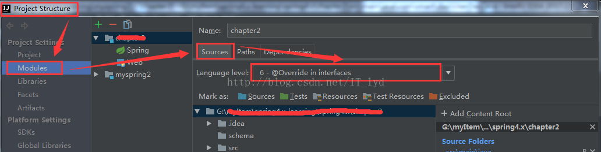

# 新建Java项目

- Intellij中New Project，选中maven

- GroupId：com.music.search（用公司迭代的样式来定义）;ArtifactId：semantic_spark（随便起）

- 删除test文件夹

- 将相关代码文件复制到java文件夹下（保证如图下方java是蓝色）

- 在java文件夹中的resources文件夹中放入配置文件，比如hanlp中的hanlp.properties（其中第一行已经配置为hdfs路径：root=hdfs://XXXX/user/baseDepSarch/Jhanlp2/）（也可以在resources中不放入hanlp.properties，转而在代码中硬编码，具体可详见该github下的代码）

- 注意此时由于没有将data文件打包进去，因此需要在udf中设置Hanlp的config，帮助找到数据文件地址

  ```scala
      HanLP.Config.IOAdapter = new HadoopFileIoAdapter //否则会报错：Caused by: java.lang.NoClassDefFoundError: Could not initialize class com.hankcs.hanlp.tokenizer.NLPTokenizer
  ```

  


# maven 编译（发现可以在上述代码放置后，直接编译，无需加入下面的内容）
### 在pom中加入maven-resources-plugin插件，和指定resources的位置。
从而避免找不到reources中配置文件的错误。

### 根据需要修改源文件
比如hanlp需要自己编写IO适配器，实现com.hankcs.hanlp.corpus.io.IIOAdapter接口以在不同的平台（Hadoop、Redis等）上运行HanLP。默认的IO适配器是基于普通文件系统的。
- HdfsFileIOAdapter继承IIOAdapter
- 重载open、create，见下面代码，此外根据代码修改pom中配置（比如添加hadoop的依赖）
- propert文件里，root指定一个hdfs路径，然后增加一行：IOAdapter=com.hankcs.hanlp.corpus.io.HdfsFileIOAdapter

```xml
<?xml version="1.0" encoding="UTF-8"?>
<project xmlns="http://maven.apache.org/POM/4.0.0"
         xmlns:xsi="http://www.w3.org/2001/XMLSchema-instance"
         xsi:schemaLocation="http://maven.apache.org/POM/4.0.0 http://maven.apache.org/xsd/maven-4.0.0.xsd">
    <modelVersion>4.0.0</modelVersion>

    <groupId>com.search.music</groupId>
    <artifactId>testsparkhanlp</artifactId>
    <version>1.0-SNAPSHOT</version>

    <properties>
        <hadoop.version>2.7.1</hadoop.version>
    </properties>

    <dependencies>
        <dependency> <!-- Hadoop dependency -->
            <groupId>org.apache.hadoop</groupId>
            <artifactId>hadoop-common</artifactId>
            <version>${hadoop.version}</version>
        </dependency>

        <dependency>
            <groupId>org.apache.hadoop</groupId>
            <artifactId>hadoop-hdfs</artifactId>
            <version>${hadoop.version}</version>
        </dependency>

        <dependency>
            <groupId>org.apache.hadoop</groupId>
            <artifactId>hadoop-mapreduce-client-core</artifactId>
            <version>${hadoop.version}</version>
        </dependency>
    </dependencies>

    <build>
        <plugins>
            <!-- 加载依赖模块的resources start -->
            <plugin>
                <groupId>org.apache.maven.plugins</groupId>
                <artifactId>maven-resources-plugin</artifactId>
                <version>2.5</version>
                <configuration>
                    <encoding>UTF-8</encoding>
                </configuration>
            </plugin>
            <!-- 加载依赖模块的resources end -->
        </plugins>
        <!-- 指定resources位置-->
        <resources>
            <resource>
                <directory>src/main/resources</directory>
                <filtering>true</filtering>
            </resource>
        </resources>
    </build>

</project>
```

```java
package com.hankcs.hanlp.corpus.io;
import java.io.*;
import java.net.URI;
import org.apache.hadoop.conf.Configuration;
import org.apache.hadoop.fs.FileSystem;
import org.apache.hadoop.fs.Path;
/**
 * @author: jomei
 * @date: 2018/3/7 17:53
 */
public class HadoopFileIoAdapter implements IIOAdapter {

    public InputStream open(String path) throws IOException {
        Configuration conf = new Configuration();
        FileSystem fs = FileSystem.get(URI.create(path), conf);
        return fs.open(new Path(path));
    }

    public OutputStream create(String path) throws IOException {
        Configuration conf = new Configuration();
        FileSystem fs = FileSystem.get(URI.create(path), conf);
        OutputStream out = fs.create(new Path(path));
        return out;
    }
}
```

##maven面板中clear，然后install
自动生成在target文件夹中

# spark-shell中使用hanlp

## 官方方法

- 将hanlp-portable-1.7.8.jar文件放入spark-shell的启动目录，并作为jar包引入

  ```linux
  spark-shell \
  --name jimmy_spark \
  --master yarn \
  --jars ./diff-match-patch-1.2.jar,./jpinyin-1.1.8.jar,./jieba-analysis-1.0.2.jar,./hanlp-portable-1.7.8.jar \
  --queue root.baseDepSarchQueue \
  --deploy-mode client \
  --executor-memory 20G \
  --executor-cores 2 \
  --num-executors 14 \
  --conf spark.sql.shuffle.partitions=2001 \
  --conf spark.network.timeout=800 \
  --conf spark.scheduler.listenerbus.eventqueue.size=100000
  ```

- 将data文件和配置文件hanlp.properties放入HDFS中

  ```linux
  hadoop fs -mkdir Search_hanlp
  hadoop fs -put hanlp.properties Search_hanlp/
  hadoop fs -put data Search_hanlp/
  ```

- 在代码中加入如下配置项，指定data文件位置，注意在udf中需要引入适配器

  ```scala
  import com.hankcs.hanlp.HanLP
  import com.hankcs.hanlp.corpus.io.IIOAdapter
  import java.io._;
  import org.apache.hadoop.conf.Configuration;
  import org.apache.hadoop.fs.FileSystem;
  import org.apache.hadoop.fs.Path;
  import java.net.URI;
  
  class HadoopFileIoAdapter extends IIOAdapter {
      @Override
      def open(path: String): java.io.InputStream = {
          val conf: Configuration = new Configuration();
          val fs: FileSystem = FileSystem.get(URI.create("hdfs://XXXX/user/baseDepSarch/Search_hanlp/" + path), conf);
          fs.open(new Path("hdfs://XXXX/user/baseDepSarch/Search_hanlp/" + path));
      }   
   
      @Override
      def create(path: String): java.io.OutputStream = {
          val conf: Configuration = new Configuration();
          val fs: FileSystem = FileSystem.get(URI.create("hdfs://XXXX/user/baseDepSarch/Search_hanlp/" + path), conf);
          fs.create(new Path("hdfs://XXXX/user/baseDepSarch/Search_hanlp/" + path));
      }
  }
  
  HanLP.Config.IOAdapter = new HadoopFileIoAdapter();
  
  val keyword_hanlp = udf{(kw: String) =>
      HanLP.Config.IOAdapter = new HadoopFileIoAdapter //否则会报错：Caused by: java.lang.NoClassDefFoundError: Could not initialize class com.hankcs.hanlp.tokenizer.NLPTokenizer
      HanLP.parseDependency(kw).toString
  }
  ```

## 补充方法（每个worker上只进行一次实例化，J非executor）

依存句法KBeamArcEagerDependencyParser的初始化非常耗时，如果按照上一节的方法调用，等于要在每个样本都初始化一次，非常耗时。又因为其非序列化，也不能将其初始化放在udf之外，然后在udf内调用，否则会报错。

```scala
val keyword_hanlp = udf{(kw: String) =>
    HanLP.Config.IOAdapter = new HadoopFileIoAdapter //否则会报错：Caused by: java.lang.NoClassDefFoundError: Could not initialize class com.hankcs.hanlp.tokenizer.NLPTokenizer
    val parser = new KBeamArcEagerDependencyParser()
    parser.parse(kw).toString
}
```

因此需要进行如下改进：

- 定一个一个独立对象（scala中的独立对象可以像static一样直接被调用）
- 在独立对象内用lazy进行初始化对象，这样在声明name时，并没有立即调用实例化方法initName(),而是在使用name时，才会调用实例化方法,并且无论缩少次调用，实例化方法只会执行一次。Scala中使用关键字lazy来定义惰性变量，实现延迟加载(懒加载)。 
  惰性变量只能是不可变变量，并且只有在调用惰性变量时，才会去实例化这个变量。
- 然后再在udf中调用该独立对象。 The `lazy val` ensures that each worker JVM initializes their own instance of the data. No serialization or broadcasts will be performed for `data`.因为即使在udf中直接用lazy，也会每次都初始化。Pull the object definition outside of the UDF's scope . Even being lazy, it will still reinitialize if it's defined in the scope of the UDF.

```scala
object myDependencyParser {
    lazy val parser = new KBeamArcEagerDependencyParser()
}
val keyword_hanlp = udf{(kw: String) =>
    HanLP.Config.IOAdapter = new HadoopFileIoAdapter //否则会报错：Caused by: java.lang.NoClassDefFoundError: Could not initialize class com.hankcs.hanlp.tokenizer.NLPTokenizer
    //HanLP.parseDependency(kw).toString
    //val parser = new KBeamArcEagerDependencyParser()
    myDependencyParser.parser.parse(kw).toString
}
```

[参考来源](https://stackoverflow.com/a/50806437)

# 避免Override错误

在重写一个类的方法时，加@override是正常的，也是阿里规约的一部分，但是在开发中加上这个注解有时候会报错：@Override is not allowed when implementing interface method，其实这也不算是个bug，是我们设置的问题，解决方案如下：



# Spark序列化问题
## 序列化的实质（J外面就是Driver端，而map就是Executor端）
在写Spark的应用时，尝尝会碰到序列化的问题。例如，在Driver端的程序中创建了一个对象，而在各个Executor中会用到这个对象 —— 由于Driver端代码与Executor端的代码运行在不同的JVM中，甚至在不同的节点上，因此必然要有相应的序列化机制来支撑数据实例在不同的JVM或者节点之间的传输。
```scala
public class Main {
    public static void main(String[] args) {
        SparkConf conf = new SparkConf().setAppName("test");
        JavaSparkContext javaSparkContext = new JavaSparkContext(conf);

        JavaRDD<Integer> rdd =
                javaSparkContext.parallelize(IntStream.range(1, 10000).boxed().collect(Collectors.toList()), 10);

        Util util = new Util();
        rdd.map(util::process); // 序列化错误
    }
}
```

这里的 `Util` 类没有实现 `Serializable` 接口，由 Driver 创建实例后，在 `map` 中传递给各个 Executor，导致序列化失败报错。

换一种解释：

Spark的官方文档再三强调那些将要作用到RDD上的操作，不管它们是一个函数还是一段代码片段，它们都是“闭包”，Spark会把这个闭包分发到各个worker节点上去执行，这里涉及到了一个容易被忽视的问题：闭包的“序列化”。

显然，闭包是有状态的，这主要是指它牵涉到的那些自由变量以及自由变量依赖到的其他变量，所以，在将一个简单的函数或者一段代码片段（就是闭包）传递给类似RDD.map这样的操作前，Spark需要检索闭包内所有的涉及到的变量（包括传递依赖的变量），正确地把这些变量序列化之后才能传递到worker节点并反序列化去执行。如果在涉及到的所有的变量中有任何不支持序列化或没有指明如何序列化自己时，你就会遇到这样的错误：

```
org.apache.spark.SparkException: Task not serializable
```

##Java序列化（J类和静态变量/方法都会随着jar包分发到executor中，无需序列化）
Java序列化，就是指将一个对象转化为二进制的byte流（注意，不是bit流），然后以文件的方式进行保存。
**Java序列化是不能序列化static变量的，因为其保存的是对象的状态，而static变量保存在全局数据区，在对象未实例化时就已经生成，属于类的状态。**

Spark 执行算子之前，会将算子需要东西准备好并打包（这就是闭包的概念），分发到不同的 executor，**<u>但这里不包括类。类存在 jar 包中，随着 jar 包分发到不同的 executors 中。当不同的 executors 执行算子需要类时，直接从分发的 jar 包取得</u>**。这时候在 driver 上对类的静态变量进行改变，并不能影响 executors 中的类。

##解决Spark序列化问题（J我经常使用静态方法来规避）
**<u>解决方法：</u>**

1. 最简单的方法就是让`Util`类可序列化： `class Util implements Serializable`
2. 如果是工具类，比如上例，没有必要创建`Util`实例，直接将`process`替换为静态方法：`public static int process(int i)`，然后在`map`方法中：`rdd.map(Util::process)`
3. 如果调用的方法比较简单，就不用创建`Util`类，直接在`map`中写 lambda 表达式即可：`rdd.map( i -> i + 1 )`；这种方法其实是创建了一个实现`Function`接口的匿名类，而`Function`接口的定义是：`public interface Function<T1, R> extends Serializable`，所以自然就可序列化了
4. 另外可以在`map`中创建`Util`实例，这样的话，每个实例都是在 Executor 端创建的，因为不需要序列化传递，就不存在序列化问题了：

```
        rdd.map(i->{
            Util util = new Util();
            LOG.info(""+util);
            return util.process(i);
        })
```
**在实际过程中的测试方法**：
```scala
import pinyin.parse
val a = sc.parallelize(Seq("你好","世界"))
val test = a.map(e=> {
    parse(e)
    })
test.take(2)

import pinyin.parse
val a = sc.parallelize(Seq("你好","世界"))
val b = a.toDF
val coder: (String => String) = (d: String) => {parse(d)}
val myfunc = udf(coder)
val c = b.withColumn("searchterm", myfunc($"value"))
c.show()
```

# Spark参数补充（--driver-memory）

在使用spark过程中，有时会因为数据增大，而出现下面两种错误:

java.lang.OutOfMemoryError: Java heap space

java.lang.OutOfMemoryError：GC overhead limit exceeded

这两种错误之前我一直认为是executor的内存给的不够，但是仔细分析发现其实并不是executor内存给的不足，而是driver的内存给的不足。**在不指定给driver分配内存时，默认分配的是512M。在这种情况下，如果处理的数据或者加载的数据很大（我是从hive中加载数据），driver就可能会爆内存，出现上面的OOM错误。**

**J因为driver端先将类加载时，会将静态变量进行初始化，从而使得加载到的字典很大，所以超过了512M。同理executor也一样要设置大一点，否则该静态变量随着jar包分发过去，内存也不够了。**

```linux
spark-shell --jars semantic_spark-1.0-SNAPSHOT.jar --master yarn --deploy-mode client --executor-memory 4G --queue root.baseDepSarchQueue --num-executors 40 --executor-cores 2 --driver-memory 4G --name Semantic_understanding
```

