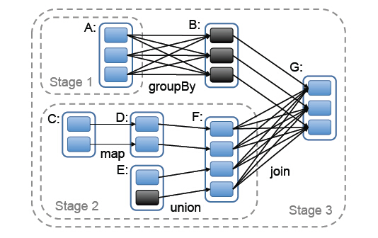
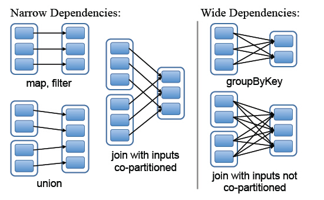
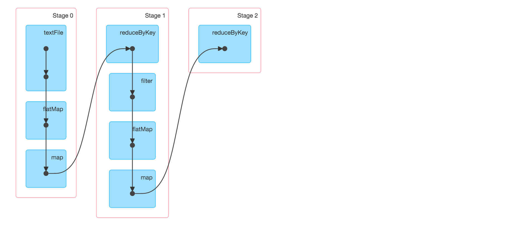
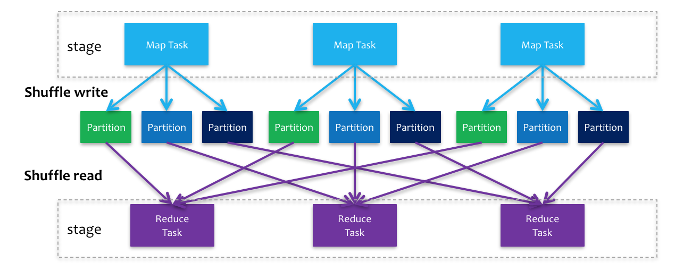

# Principle

**可以注意下面下划线文字即可。**

##基础知识
**spark应用application 由驱动器程序driver program来发起集群上的操作，该驱动器程序通过sparkcontext对象来访问spark集群，这个对象代表对计算集群的一个链接。**

spark用户提交的任务成为application，一个application对应一个sparkcontext，app中存在多个job，每触发一次action操作就会产生一个job。

每个spark应用都由一个驱动器程序（driver program）来发起集群上的各种并行操作，比如spark shell本身就是实际的驱动器程序。

驱动器程序通过sparkcontext对象来访问Spark（驱动器程序内有sparkcontext），这个对象代表对计算集群的一个链接，spark-shell启动时自动创建了一个sparkcontext对象，sc是sparkcontext对象。

##运行架构

**Application 指的是用户编写的Spark应用程序，包含了一个Driver 功能的代码和分布在集群中多个节点上运行的Executor代码**。

在Spark中**由SparkContext负责和ClusterManager通信**，进行资源的申请、任务的分配和监控等；

**<u>Executor：Application运行在Worker 节点上的一个进程</u>，**该进程负责运行Task，并且负责将数据存在内存或者磁盘上，每个Application都有各自独立的一批Executor。

// 集群管理器：Cluster Manager：指的是在集群上获取资源的外部服务，目前有：
// Ø  Standalone：Spark原生的资源管理，由Master负责资源的分配；
// Ø  **Hadoop Yarn**：由YARN中的ResourceManager负责资源的分配；

**<u>Worker：集群中任何可以运行Application代码的节点</u>**

##作业job，阶段stage，任务task

**一个JOB包含多个RDD及作用于相应RDD上的各种Operation。当你需要执行一个 rdd 的 action 的时候，会生成一个 job。**

**DAG directed acyclic graphs有向无环图 确定依赖关系，借此来划分stage,调度器从DAG图末端出发，逆向遍历整个依赖关系链，遇到ShuffleDependency（宽依赖关系的一种叫法）就断开，遇到NarrowDependency就将其加入到当前stage。**

**<u>stage中task数目由stage末端的RDD分区个数来决定！</u>**

<u>任务（Task）： 分配到集群上的某个节点的某个Executor的cores核数去执行，因为每个节点可以起一个或多个Executor。</u>

**<u>Task被执行的并发度 = Executor数目 * 每个Executor核数，计算能否一下子全部执行完。如果100个task，只有80个资源，那么20个就等下一波。</u>**

具体过程：**当rdd触发action操作之后，会调用SparkContext的runJob方法，最后调用的DAGScheduler.handleJobSubmitted方法完成整个job的提交。然后DAGScheduler根据RDD的lineage进行Stage划分，再生成TaskSet，由TaskScheduler向集群申请资源，最终在Woker节点的Executor进程中执行Task。spark context：控制整个application的生命周期，包括dagsheduler和task scheduler等组件。**

**作业（Job）：包含多个Task组成的并行计算**，往往由Spark Action催生，**一个JOB包含多个RDD及作用于相应RDD上的各种Operation**；
简单理解：**当你需要执行一个 rdd 的 action 的时候，会生成一个 job。**

阶段（Stage）：每个Job会被拆分很多组Task，每组任务被称为Stage，也可称TaskSet，一个作业分为多个阶段；stage会以特定的顺序执行。

stage的划分是Spark作业调度的关键一步，它基于DAG确定依赖关系，借此来划分stage，将依赖链断开，每个stage内部可以并行运行，整个作业按照stage顺序依次执行，最终完成整个Job。实际应用提交的Job中RDD依赖关系是十分复杂的，依据这些依赖关系来划分stage自然是十分困难的，Spark此时就利用了前文提到的依赖关系，调度器从DAG图末端出发，逆向遍历整个依赖关系链，遇到ShuffleDependency（宽依赖关系的一种叫法）就断开，遇到NarrowDependency就将其加入到当前stage。**stage中task数目由stage末端的RDD分区个数来决定**，RDD转换是基于分区的一种粗粒度计算，一个stage执行的结果就是这几个分区构成的RDD。



窄依赖，父RDD的**分区**最多只会被子RDD的一个**分区**使用。

宽依赖，父RDD的一个**分区**会被子RDD的多个**分区**使用。



在两个stages的边界处，parent stage中的tasks会将数据写入磁盘，然后child stage中的tasks会通过网络来读取这些数据。因此，stage boundary会带来很可观的磁盘I/O和网络I/O。

## Shuffle（J有shuffle就是分stage的依据）

<u>**Shuffle是MapReduce框架中的一个特定的阶段，介于Map阶段和Reduce 阶段之间。当Map的输出结果在被Reduce使用之前，输出结果先按key哈希，然后分发到每一个Reducer上，这个过程就是shuffle。**由于shuffle涉及到了磁盘I/O和网络I/O,以及序列化，因此**shuffle性能的高低直接影响到了整个程序的运行效率**</u>

eg：**reducebykey是转化，但也触发 rdd 的 <u>shuffle 操作，是分stage的依据</u>**

```scala
val tokens = sc.textFile("path-to-file.txt").flatMap(_.split(" "))
val wordCounts = tokens.map((_, 1)).reduceByKey(_ + _)
val filtered = wordCounts.filter(_._2 >= 1000)
val charCounts = filtered.flatMap(_._1.toCharArray).map((_, 1)).reduceByKey(_ + _)
charCounts.collect
```



### Shuffle的基本原理与特性

**<u>注意下面的partitions在shuffle过程中，就是指下图中的第二层和第三层，在图中都是3。J理解为一个task要被分为多少份数据，被用来进行下一步的shuffle！</u>**

与MapReduce计算框架一样，Spark的Shuffle实现大致如下图所示，在DAG阶段以shuffle为界，划分stage，上游stage做map task，每个map task将计算结果数据分成多份，每一份对应到下游stage的每个partition中，并将其临时写到磁盘，该过程叫做shuffle write；下游stage做reduce task，每个reduce task通过网络拉取上游stage中所有map task的指定分区结果数据，该过程叫做shuffle read，最后完成reduce的业务逻辑。举个栗子，假如上游stage有100个map task，下游stage有1000个reduce task，那么这100个map task中每个map task都会区分得到1000份数据，而1000个reduce task中的每个reduce task都会拉取上游100个map task对应的那份数据，即第一个reduce task会拉取所有map task结果数据的第一份，以此类推。<u>**（J注意这里的1000才是spark.sql.shuffle.partitions，该参数代表了shuffle read task的并行度，该值默认是200）**</u>



###spark通过合理设置spark.default.parallelism参数提高执行效率

Clusters will not be fully utilized unless you set the level of parallelism for each operation high enough. Spark automatically sets the number of “map” tasks to run on each file according to its size (though you can control it through optional parameters to `SparkContext.textFile`, etc), and for distributed “reduce” operations, such as `groupByKey` and `reduceByKey`, it uses the largest parent RDD’s number of partitions. You can pass the level of parallelism as a second argument (see the `spark.PairRDDFunctions` documentation), or set the config property`spark.default.parallelism` to change the default. **<u>In general, we recommend 2-3 tasks per CPU core in your cluster.</u>**

**<u>J似乎其实这两个参数都是设置partitions数目的，只是parallelism会被dataframe所忽略，所以之前我的设置根本没啥用。</u>**

From the answer [here](https://stackoverflow.com/questions/33297689/number-reduce-tasks-spark), `spark.sql.shuffle.partitions` configures the number of partitions that are used when shuffling data for joins or aggregations.

`spark.default.parallelism` is the default number of partitions in `RDD`s returned by transformations like `join`, `reduceByKey`, and `parallelize` when not set explicitly by the user. Note that `spark.default.parallelism` seems to only be working for raw `RDD` and is ignored when working with dataframes.