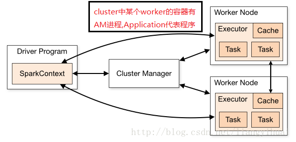

# Spark shell
spark-shell的启动：spark-shell其实是对spark-submit的一层封装。**可以注意下面下划线文字即可。**

## --master yarn
<u>**J所以一定是yarn。**</u>

现在越来越多的场景，都是Spark跑在Hadoop集群中，所以为了做到资源能够均衡调度，会使用YARN来做为Spark的Cluster Manager，来为Spark的应用程序分配资源。

## --deploy-mode client
<u>**这里必须是client。**</u>（具体概念见下图红色字就有感性认识）

不同于spark-submit的yarn-cluster, 因为spark-shell作为一个与用户交互的命令行，必须将Driver运行在本地，而不是yarn上, 其他的参数与submit一样。

J这么理解：**<u>Application指的是用户编写的Spark应用程序，包含了一个Driver 功能的代码和分布在集群中多个节点上运行的Executor代码。spark应用application 由驱动器程序driver program来发起集群上的操作，该驱动器程序通过sparkcontext对象来访问spark集群，这个对象代表对计算集群的一个链接</u>**。

而在在YARN中，**<u>每个Application实例都有一个ApplicationMaster进程</u>，它是Application启动的第一个容器**。它负责和ResourceManager打交道并请求资源，获取资源之后告诉NodeManager为其启动Container。

**<u>Application Master是运行在worker中的容器内的</u>**。

在YARN-Cluster模式下，**Driver运行在AM(Application Master)**中，它负责向YARN申请资源，并监督作业的运行状况。当用户提交了作业之后，就可以关掉Client，作业会继续在YARN上运行，因而YARN-Cluster模式不适合运行交互类型的作业；

在YARN-Client模式下，Application Master仅仅向YARN请求Executor，Client会和请求的Container通信来调度他们工作，也就是说Client不能离开。**client客户端就是包含application（其中包含driver）**。

所以spark-shell的--deploy-mode设置为client。
否则会报错：Error: Cluster deploy mode is not applicable to Spark shells.


###运行流程（大致过程）
我们使用spark-submit提交一个Spark作业之后，这个作业就会启动一个对应的Driver进程。
**而Driver进程要做的第一件事情，就是向集群管理器申请运行Spark作业需要使用的资源，<u>这里的资源指的就是Executor进程</u>**。Jspark中的executor就是作为yarn中的container来运行。
**YARN集群管理器会根据我们为Spark作业设置的资源参数，在各个工作节点Node上，启动一定数量的Executor进程，每个Executor进程都占有一定数量的内存和CPU core**。

**在申请到了作业执行所需的资源之后，Driver进程就会开始调度和执行我们编写的作业代码了。<u>Driver进程会将我们编写的Spark作业代码分拆为多个stage，每个stage执行一部分代码片段，并为每个stage创建一批task，然后将这些task分配到各个Executor进程中执行。task是最小的计算单元，负责执行一模一样的计算逻辑（也就是我们自己编写的某个代码片段）</u>，只是每个task处理的数据不同而已。一个stage的所有task都执行完毕之后，会在各个节点本地的磁盘文件中写入计算中间结果，然后Driver就会调度运行下一个stage。下一个stage的task的输入数据就是上一个stage输出的中间结果。如此循环往复，直到将我们自己编写的代码逻辑全部执行完，并且计算完所有的数据，得到我们想要的结果为止。**

## --num-executors
**<u>每个Spark作业的运行一般设置50~100个左右的Executor进程比较合适，设置太少或太多的Executor进程都不好。</u>**设置的太少，无法充分利用集群资源；设置的太多的话，大部分队列可能无法给予充分的资源。

## --executor-memory
**<u>每个Executor进程的内存设置4G~ 8G较为合适。但是这只是一个参考值</u>**，具体的设置还是得根据不同部门的资源队列来定。可以看看自己团队的资源队列的最大内存限制是多少，**<u>num-executors乘以executor-memory，是不能超过队列的最大内存量的。此外，如果你是跟团队里其他人共享这个资源队列，那么申请的内存量最好不要超过资源队列最大总内存的1/3~1/2</u>**，避免你自己的Spark作业占用了队列所有的资源，导致别的同学的作业无法运行。
J从队列中看到300G，所以4*40.

## --executor-cores
该参数用于设置每个Executor进程的CPU core数量。这个参数决定了每个Executor进程并行执行task线程的能力。因为**<u>每个CPU core同一时间只能执行一个task线程，因此每个Executor进程的CPU core数量越多，越能够快速地执行完分配给自己的所有task线程</u>**。
参数调优建议：**<u>Executor的CPU core数量设置为2~4个较为合适。</u>**同样得根据不同部门的资源队列来定，可以看看自己的资源队列的最大CPU core限制是多少，再依据设置的Executor数量，来决定每个Executor进程可以分配到几个CPU core。同样建议，**<u>如果是跟他人共享这个队列，那么num-executors * executor-cores不要超过队列总CPU core的1/3~1/2左右比较合适</u>**，也是避免影响其他同学的作业运行。
J从队列中看到有415cores，所以4*40

## 最终命令
```spark-shell --master yarn --deploy-mode client --executor-memory 4G --queue root.baseDepSarchQueue --num-executors 40 --executor-cores 4 --name Burst_detection```

我的情况160G，160cores
估计之前很多数据，中间30天的3端统计量有90亿的数据，生成1亿的最终数据。
下面是hadoop界面中的队列资源使用情况：

```
Used Resources:	<memory:205824, vCores:161>
Num Active Applications:	1
Num Pending Applications:	0
Min Resources:	<memory:307200, vCores:415>
Max Resources:	<memory:307200, vCores:415>
```

## 另一份参考命令

```linux
#!/bin/bash
##********************************************************************#
##
## 日期支持运算，通过以下方式：
## ${DATA_DATE offset field formatter}，
## DATE_DATE：*固定值，为当前作业的业务时间
## offet：*必填，当前的日期偏移量，根据field判定偏移字段，取值为数值可正可负
## field：*必填，偏移的字段，取值可以为：day，month，year，minute，hour，week，second
## formatter：选填，计算偏移后的日期格式，如：yyyy-MM-dd HH:mm:ss
## 如：${DATA_DATE -1 day 'yyyy-MM-dd HH:mm'}
##********************************************************************#
#初始版本为001,后面修改为递增1
VERSION="V1.00.001" 

###############################引入公共函数库#########################
source $BIPROG_ROOT/bin/shell/common.sh
###### 输入参数 ################
vDay="${DATA_DATE}"
# 输入表，含text_id, content两个字段，对content进行分词
dataTab="temp.tmp_scid_comment_text"
# 结果表，存储分词结果
resTab="temp.tb_scid_comment_text_seg_res"

echo $vDay
echo $dataTab
echo $resTab


###### spark的必调参数 ##########
app_queue=root.default
app_name=tb_scid_comment_text_seg_res-${vDay}

executor_cores=2
executor_memory=4G
initialExecutors=0
maxExecutors=200
minExecutors=0
driver_memory=6G
partitions=200
autoBroadcastJoinThreshold=200000000
memoryOverhead=1024
broadcastTimeout=10000

executeEnv="spark-submit \
--deploy-mode cluster  \
--master yarn \
--queue ${app_queue} \
--name  ${app_name} \
--executor-cores ${executor_cores} \
--executor-memory ${executor_memory} \
--driver-memory ${driver_memory} \
--conf spark.sql.shuffle.partitions=${partitions} \
--conf spark.dynamicAllocation.initialExecutors=${initialExecutors} \
--conf spark.dynamicAllocation.minExecutors=${minExecutors} \
--conf spark.dynamicAllocation.maxExecutors=${maxExecutors} \
--conf spark.yarn.executor.memoryOverhead=${memoryOverhead} \
--conf spark.sql.broadcastTimeout=${broadcastTimeout} \
--conf spark.sql.autoBroadcastJoinThreshold=${autoBroadcastJoinThreshold} \
--conf spark.ui.port=9092 \
--conf spark.driver.maxResultSize=10g \
--conf spark.dynamicAllocation.enabled=true \
--conf spark.dynamicAllocation.executorIdleTimeout=300s \
--conf spark.dynamicAllocation.schedulerBacklogTimeout=10s \
--conf spark.dynamicAllocation.cachedExecutorIdleTimeout=300s \
--conf spark.debug.maxToStringFields=500 \
--conf spark.files.fetchTimeout=900s \
--conf spark.kryoserializer.buffer.max=2000m \
--conf spark.network.timeout=10000000 \
--conf spark.rpc.message.maxSize=2047 \
--conf spark.schedul.listenerbus.eventqueue.size=100000 \
--conf spark.shuffle.service.enabled=true \
--conf spark.yarn.archive=hdfs://XXXX/data1/sparkjars245 \
--conf spark.yarn.dist.files=hdfs://XXXX/data1/sparkjars245/hive-site.xml \
--conf spark.yarn.driver.memoryOverhead=1024 \
--conf spark.default.parallelism=200 \
--files hdfs://XXXX/user/XXXXXX/file/stanford_nlp_pos_tagger/english-left3words-distsim.tagger \
--class net.XXXXX.segComment.segCommentWithNature \
${seg_comment_jar}
"

${executeEnv} ${vDay} ${dataTab} ${resTab}
if [ $? -ne 0 ]; then exit 1; fi
```


##References

- [ spark-shell运行spark任务参数设置](http://blog.csdn.net/zrc199021/article/details/52635819)
- [Spark运行模式](http://blog.csdn.net/liangyihuai/article/details/56676878)